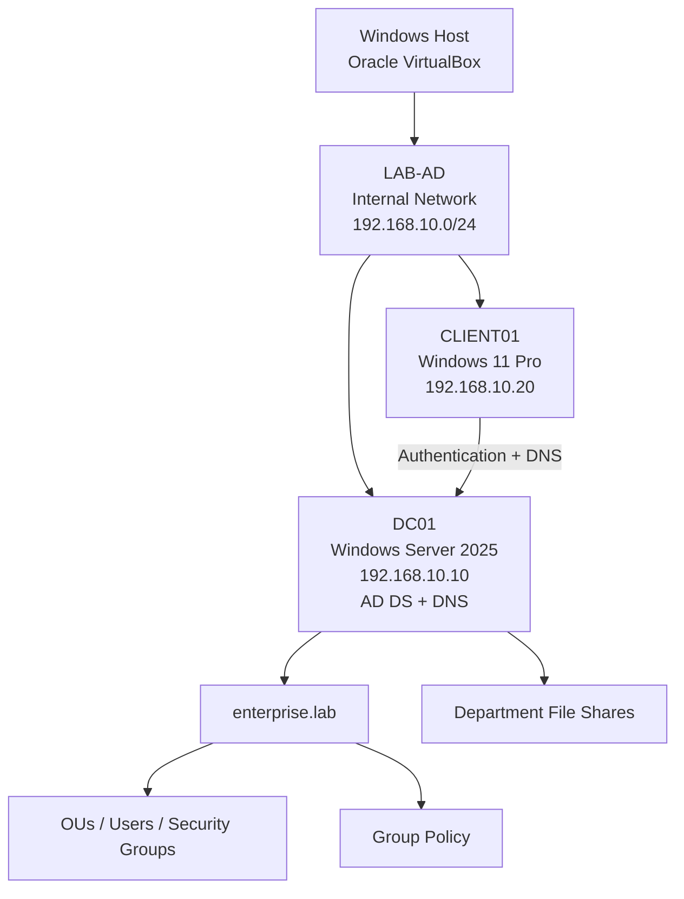

# Enterprise Active Directory Lab

Personal Windows infrastructure and cybersecurity lab simulating a small enterprise Active Directory environment with **Windows Server 2025**, **Windows 11 Pro** and **VirtualBox**.

## Overview

The objective was to deploy and administer a functional Microsoft Active Directory environment and understand how networking, DNS, centralized authentication, users and groups, Group Policy, file permissions, PowerShell administration, logging and basic security checks work together.

This is a learning lab built with one domain controller and one Windows client.

## Architecture

| Component | Configuration |
|---|---|
| **Domain** | `enterprise.lab` |
| **NetBIOS** | `ENTREPRISE` |
| **Network** | `LAB-AD` — `192.168.10.0/24` |
| **DC01** | Windows Server 2025 · `192.168.10.10` · AD DS + DNS |
| **CLIENT01** | Windows 11 Pro · `192.168.10.20` · DNS `192.168.10.10` |

## What I implemented

### Active Directory and DNS
- Installed **AD DS** and DNS on DC01.
- Created the forest and domain **enterprise.lab**.
- Promoted DC01 as the first domain controller.
- Verified DNS and the five FSMO roles.

### Organizational structure
Created OUs for **Informatique**, **RH**, **Direction** and **Ordinateurs**, with security groups:
- `GRP_Informatique`
- `GRP_RH`
- `GRP_Direction`

### Domain workstation
- Installed and configured **CLIENT01**.
- Joined it to `enterprise.lab`.
- Verified domain authentication with `whoami` and `%logonserver%`.

### Group Policy
Implemented:
- `GPO_Informatique_Restrictions` — user restriction for the Informatique OU.
- `GPO_Ordinateurs_Securite` — security warning before logon on CLIENT01.

GPO application was checked with `gpupdate /force` and `gpresult /r`.

### File shares and permissions

| Network share | Authorized group |
|---|---|
| `\\DC01\Informatique` | `GRP_Informatique` |
| `\\DC01\RH` | `GRP_RH` |
| `\\DC01\Direction` | `GRP_Direction` |

Both **share permissions** and **NTFS permissions** were configured and tested with authorized and unauthorized users.

### PowerShell administration
Used the Active Directory PowerShell module to:
- list users and groups;
- inspect group membership;
- create a domain user;
- add a user to a security group;
- export account information to CSV;
- inspect disabled accounts and the domain password policy.

See [scripts/active-directory-commands.ps1](scripts/active-directory-commands.ps1).

### Security auditing and diagnostics
Performed:
- Event Viewer review of **4624** and **4625** authentication events;
- disabled account review;
- default domain password policy review;
- Windows Firewall profile check;
- `dcdiag`;
- `dcdiag /test:dns`;
- `repadmin /replsummary`;
- `netdom query fsmo`.

## Validation

- Domain authentication from CLIENT01: **successful**
- DNS resolution of `enterprise.lab`: **successful**
- User and computer GPOs: **applied**
- Department share access controls: **validated**
- Domain controller diagnostics: **successful tests observed**
- DNS diagnostic: **successful**
- Windows Firewall: **Domain, Private and Public profiles enabled**

## Limitations

This is a **single-domain-controller learning lab**, so there is no inter-DC replication to validate.

During `nslookup enterprise.lab`, an initial timeout / `Server: Unknown` message appeared before the domain successfully resolved to `192.168.10.10`. This was documented rather than hidden.

The observed default domain policy also had `LockoutThreshold = 0`, so automatic account lockout was not enabled during the documented tests.

## Documentation

**Full report:** [docs/Enterprise_Active_Directory_Lab.pdf](docs/Enterprise_Active_Directory_Lab.pdf)

Architecture details: [diagrams/architecture.md](diagrams/architecture.md)

## Skills practiced

Windows Server · Active Directory · DNS · IPv4 · VirtualBox networking · OUs · Security groups · Domain integration · GPO · NTFS permissions · SMB shares · PowerShell · Event Viewer · Security auditing · AD diagnostics

## Author

**Abdelrahmane SHANAN**  
Personal infrastructure & cybersecurity project
