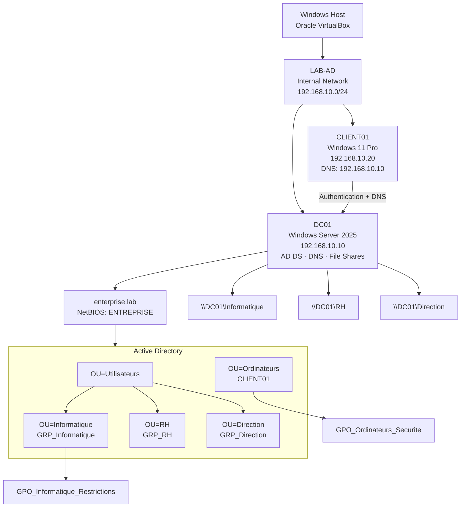

# Lab Architecture

| Component | Value |
|---|---|
| Domain | `enterprise.lab` |
| NetBIOS | `ENTREPRISE` |
| VirtualBox network | `LAB-AD` |
| Subnet | `192.168.10.0/24` |
| DC01 | `192.168.10.10` |
| CLIENT01 | `192.168.10.20` |
| CLIENT01 DNS | `192.168.10.10` |

The lab uses an isolated VirtualBox internal network with no default gateway.
